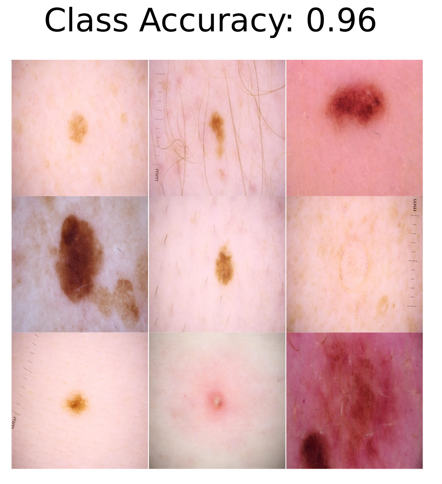
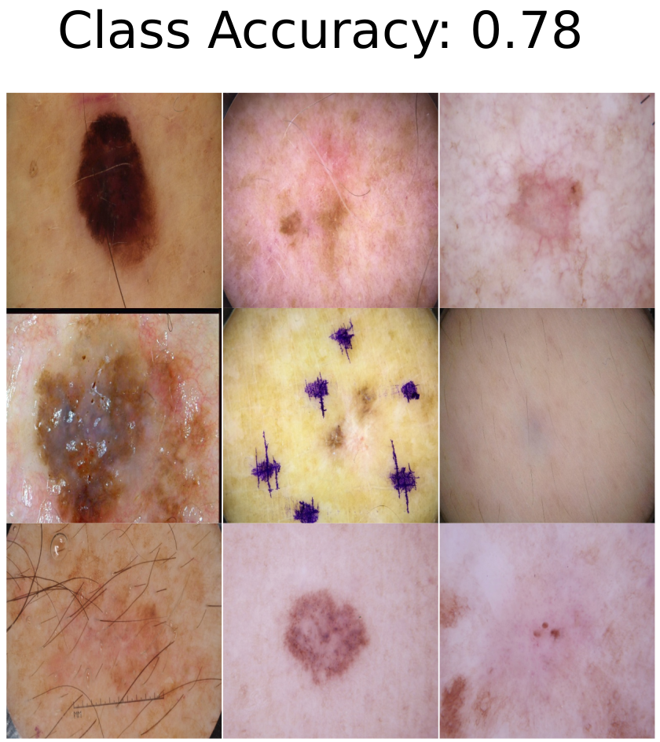
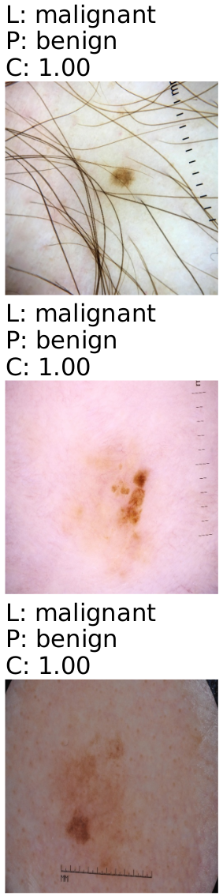
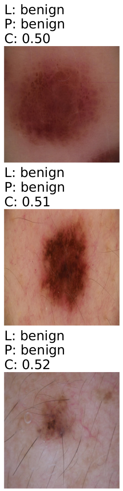

# Purpose
This toolkit is designed to analyse the underlying representation of a image classification network.  
It is designed to be compatable with the outputs of the https://github.com/IML-DKFZ/fd-shifts Failure Detection Benchmark described in this paper (https://arxiv.org/abs/2211.15259).

# Outputs
Generates outputs for representative images based on a k-means clustering of the latent space. Latent space dimenstions are reduced to 50 by pca and further condensed to 3 by t-SNE.   
Generates the most overconfident as well as underconfident images based on the softmax response (could be adjusted to other confidence score).
The app.py file can be run by "python3 app.py" and starts an interactive dash app that allows the user to explore the latent space of the neural network and the images linked to each data point. The data necessary to run the app can be generated by the package if raw outputs are present. After initalizing the main analyser simply run analyzer.prepaire_dash() and the correct data frame is written.
    
  



# Instructions :movie_camera:
1) Create a new fodler  
2) Create a new virtual environment  
3) Update your pip  
4) Install the package (pip install  pip install visualfailureanalysis)  
5) Setup your folder in the form "../experiemnt_group_name/experiment_name/test_results"  
6) In this folder place your data as raw_outputs.npz  
7)  Format: Outputs of the softmax in the first columns followed by the label as an integer and dataset integer index in the last column. Each row is one data point. If you only have one data set the index is always 0.  
8) In this folder place your latent space as encoded_output.npz  
9) Format: Outputs of the penultimate layer (e.g. inputs to the final layer) in the first columns and dataset index in the last. Each row is one data point.   
10) In this folder place your data as attribution.csv
11) attributions.csv needs to at least contain a column called "filepath" containing the absolute filepaths of your images. If you have multiple data sets attributions are renamed to "attributions0.csv","attributions1.csv",..  
12) All three data files need the rows to be in the same order :exclamation:  
13) In python: from visualfailureanalysis import analyser  
14) Initalize the main class: my_data_visulizer = analyser.Analyser(path=path,class2name=class2name,class2plot=class2plot,ls_testsets=ls_testsets,test_datasets=test_datasets)  
15) path ="../experiemnt_group_name/experiment_name"  
16) class2plot = dict({0:"myclassname0",...}) conatianing a mapping of integer classes to real names   
17) ls_testsets = ["nameoftestset",...] a list with names of all testsets  
18) class2plot and test_datasets are two lists with a subset of classes/ testset names for which to generate outputs. (output can be quite large)  
19) run my_data_visulizer.setup() to link the create the lower dimensional representation needed  
20) generate outputs and statistics with the respective class methods.  
Example Tree:  
|--project  
&emsp;|--experiment_group_name  
&emsp;&emsp;|--experiment_name  
&emsp;&emsp;&emsp;|--test_results  
&emsp;&emsp;&emsp;&emsp;|--raw_output.npz  
&emsp;&emsp;&emsp;&emsp;|--encoded_output.npz  
&emsp;&emsp;&emsp;&emsp;|--attribution.csv  

raw_outputs.npz  
Nx(d+2)
```

  0, 1, ...                 d─1,   d,      d+1  
┌───────────────────────────────┬───────┬─────────────┐  
|           softmax1            | label | dataset_idx |  
├───────────────────────────────┼───────┼─────────────┤  
|           softmax2            | label | dataset_idx |  
├───────────────────────────────┼───────┼─────────────┤  
|           softmax3            | label | dataset_idx |  
└───────────────────────────────┴───────┴─────────────┘  
.  
.  
.  
┌───────────────────────────────┬───────┬─────────────┐  
|           softmaxN            | label | dataset_idx |  
└───────────────────────────────┴───────┴─────────────┘  
```
encoded_output.npz  
Nx(latent_d+1)  
```
  0, 1, ...                 d─1,   d    
┌───────────────────────────────┬─────────────┐  
|           encoded1            | dataset_idx |  
├───────────────────────────────┼─────────────┤  
|           encoded2            | dataset_idx |  
├───────────────────────────────┼─────────────┤  
|           encoded3            | dataset_idx |  
└───────────────────────────────┴─────────────┘  
.  
.  
.  
┌───────────────────────────────┬─────────────┐  
|           encodedN            | dataset_idx |  
└───────────────────────────────┴─────────────┘  
```

## Acknowledgements

<br>

<p align="center">
   &nbsp;&nbsp;&nbsp;&nbsp;
   &nbsp;&nbsp;&nbsp;&nbsp;
  
</p>
