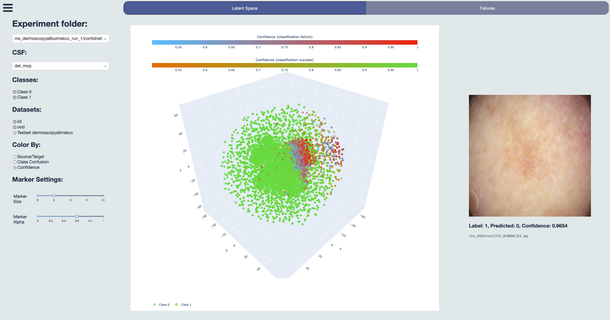

# SF-Visuals



## Citing This Work

If you use sf-visuals please cite our [paper]()

```bibtex
@misc{bungert2023understanding,
      title={Understanding Silent Failures in Medical Image Classification},
      author={Till J. Bungert and Levin Kobelke and Paul F. Jaeger},
      year={2023},
      eprint={2307.14729},
      archivePrefix={arXiv},
      primaryClass={eess.IV}
}
```

> **Note**  
> This repository contains the visualization tool only. The benchmark part of our paper is integrated into [fd-shifts](https://github.com/IML-DKFZ/fd-shifts).

## Table Of Contents

<!--toc:start-->

- [Installation](#installation)
- [Usage](#usage)
- [Acknowledgements](#acknowledgements)

<!--toc:end-->

## Installation

Currently, this depends on [fd-shifts](https://github.com/IML-DKFZ/fd-shifts), please check out its installation instructions first.

```bash
pip install git+https://github.com/iml-dkfz/sf-visuals.git
```

## Usage

### Experiment Folder Setup

Collect all of your experiments in a folder, with one experiment per subfolder. Experiment subfolders need to contain the following files:

For a classifier with `l` latent space dimensions and `d` outputs and `N` samples in total (over all tested datasets) and for `M` dropout samples

#### `raw_outputs.npz`

Shape: `Nx(d+2)`

```

  0, 1, ...                 d─1,   d,      d+1
┌───────────────────────────────┬───────┬─────────────┐
|           softmax_1           | label | dataset_idx |
├───────────────────────────────┼───────┼─────────────┤
|           softmax_2           | label | dataset_idx |
├───────────────────────────────┼───────┼─────────────┤
|           softmax_3           | label | dataset_idx |
└───────────────────────────────┴───────┴─────────────┘
.
.
.
┌───────────────────────────────┬───────┬─────────────┐
|           softmax_N           | label | dataset_idx |
└───────────────────────────────┴───────┴─────────────┘
```

#### `encoded_output.npz`

Shape: `Nx(l+1)`

```
  0, 1, ...                 l─1,   l
┌───────────────────────────────┬─────────────┐
|           encoded1            | dataset_idx |
├───────────────────────────────┼─────────────┤
|           encoded2            | dataset_idx |
├───────────────────────────────┼─────────────┤
|           encoded3            | dataset_idx |
└───────────────────────────────┴─────────────┘
.
.
.
┌───────────────────────────────┬─────────────┐
|           encodedN            | dataset_idx |
└───────────────────────────────┴─────────────┘
```

#### `external_confids.npz`

Shape: `Nx1`

#### `raw_outputs_dist.npz`

Shape: `NxdxM`

```
  0, 1, ...                  d─1
┌───────────────────────────────┐
|  softmax_1 (Dropout Sample 1) |
|  softmax_1 (Dropout Sample 2) |
|               .               |
|               .               |
|               .               |
|  softmax_1 (Dropout Sample M) |
├───────────────────────────────┤
|  softmax_2 (Dropout Sample 1) |
|  softmax_2 (Dropout Sample 2) |
|               .               |
|               .               |
|               .               |
|  softmax_2 (Dropout Sample M) |
├───────────────────────────────┤
|  softmax_3 (Dropout Sample 1) |
|  softmax_3 (Dropout Sample 2) |
|               .               |
|               .               |
|               .               |
|  softmax_3 (Dropout Sample M) |
└───────────────────────────────┘
                .
                .
                .
┌───────────────────────────────┐
|  softmax_N (Dropout Sample 1) |
|  softmax_N (Dropout Sample 2) |
|               .               |
|               .               |
|               .               |
|  softmax_N (Dropout Sample M) |
└───────────────────────────────┘
```

#### `external_confids_dist.npz`

```
NxM
```

#### `attributions.csv`

```csv
...,filepath,...
...,path/to/image01.jpg,...
...,path/to/image02.jpg,...
...,path/to/image03.jpg,...
.
.
.
...,path/to/imageN.jpg,...
```

#### `config.yaml`

```yaml
eval:
    val_tuning: true  # or false, whether or not the first dataset_idx refers to a validation set
    confidence_measures:
        test:  # list of confidences
        - msr
        - dg
        - confidnet
        ...
    query_studies:  # key-value pairs where values are either datasets or list of datasets
        iid_study: dataset01
        ...

data:
    dataset: my_dataset  # name of the training set
```

### Running the Tool

```bash
sf-visuals --experiments-path /path/to/experiments/folder --data-path /path/to/datasets
```

## Acknowledgements

<br>

<p align="center">
   &nbsp;&nbsp;&nbsp;&nbsp;
   &nbsp;&nbsp;&nbsp;&nbsp;
  
</p>
